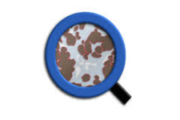

External Software and OMERO
===========================

Here we describe how to use third party tools to analyze data stored in OMERO.
We provide installation instructions, step-by-step workflow either to use the User Interface
or the API of those tools.

.. list-table::
   :widths: 1 2 3

   * - \ |cellprofiler|_
     - :doc:`cellprofiler/docs/index`
     - .. include:: cellprofiler/docs/index.rst
         :start-line: 3
         :end-before: Contents
   * - \ |fiji|_
     - :doc:`fiji/docs/index`
     - .. include:: fiji/docs/index.rst
         :start-line: 3
         :end-before: Contents
   * - \ |ilastik|_
     - :doc:`ilastik/docs/index`
     - .. include:: ilastik/docs/index.rst
         :start-line: 3
         :end-before: Contents
   * - \ |orbit|_
     - :doc:`orbit/docs/index`
     - .. include:: orbit/docs/index.rst
         :start-line: 3
         :end-before: Contents
   * - \ |qupath|_
     - :doc:`qupath/docs/index`
     - .. include:: qupath/docs/index.rst
         :start-line: 3
         :end-before: Contents
   * - \ |trackmate|_
     - :doc:`trackmate/docs/index`
     - .. include:: trackmate/docs/index.rst
         :start-line: 3
         :end-before: Contents

.. |fiji| image:: images/logos/fiji.png
   :width: 1.125in
   :height: 1.125in

.. toctree::
    :maxdepth: 1
    :hidden:

    cellprofiler/docs/index
    fiji/docs/index
    ilastik/docs/index
    orbit/docs/index
    qupath/docs/index
    trackmate/docs/index
