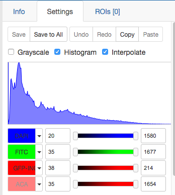
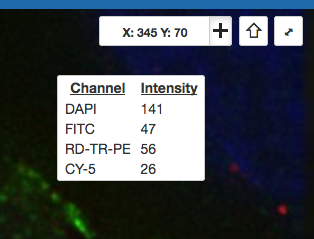
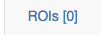
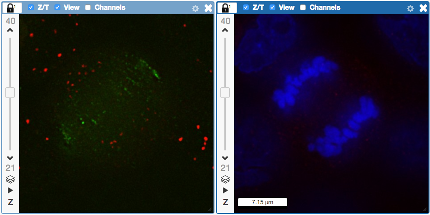

View images in OMERO.iviewer
============================

We introduce 
OMERO.iviewer, a 2D viewer which can
open and browse multi-t, multi-z and multi-channel images and allows to 
draw and edit Regions of Interest.
It also offers the ability to view several images at the same time and synchronize the
view.

Description
-----------

We will show here:

-  How to open multidimensional images in OMERO.iviewer

-  How to change rendering settings in OMERO.iviewer and scroll through z and t

-  How to use the Histogram feature

-  How to inspect the intensities, zoom and rotate the image

-  How to draw ROIs on the image

-  How to view ROIs associated with different z or t planes

-  How to use Planes tab in OMERO.iviewer to see the spread of ROIs in multi-z, t images

-  How to create comments on ROIs and enable and disable the ROI popups

-  How to produce simple analysis results from the ROIs and and export the results locally

-  How to save a current viewport as png in OMERO.iviewer

-  How to use and synchronize multiple viewer windows inside OMERO.iviewer

Resources
---------

New features video (ROI popups, ROIs on multi-z or multi-t images)

-  https://youtu.be/yDW5Sg0I1GU

Example files used

-  https://downloads.openmicroscopy.org/images/DV/siRNAi-HeLa/

Note: Only some of the images in this dataset are z-stacks, for example

-  https://downloads.openmicroscopy.org/images/DV/siRNAi-HeLa/IN_03.r3d_D3D.dv

Setup
-----

**OMERO.iviewer installation**

OMERO.iviewer is a pip installable application for OMERO.web. Follow the
steps described in \ https://pypi.org/project/omero-iviewer/\  to install
it and configure the OMERO.web accordingly.

The walkthrough assumes that OMERO.iviewer has been set up as the
default viewer for OMERO.web.

Step-by-Step
------------

#. Double-click on an Image thumbnail, or click the ``Full Viewer`` |image1|\  button in the right-hand pane to open an Image in a larger viewer called OMERO.iviewer. It is a Web app developed and released independently from the webclient. The OMERO.web framework can be extended with multiple apps to view data in different ways.

#. We can adjust the rendering settings and scroll through Z or T.

   .. image:: images/Iviewer2.png

#. Still staying in the ``Settings`` tab in the right-hand side of OMERO.iviewer, click on the checkbox next to the ``Histogram`` word |image0| near the top.

#. A histogram of the first channel which is on will appear. Note that when you move the rendering settings sliders beneath the histogram, the histogram updates to showing the channel you just manipulated.

   |image0b|

#. Click the ``Crosshairs`` icon |image3| at the top-right of the viewer to enable the pixel intensity display for the mouse pointer. Then mouse over the Image to see the pixel intensities for the channels turned on.

   .. image:: images/Iviewer4.png

#. The ROIs tab  |image5|\  includes tools for viewing and drawing ROIs on the Image. These are saved back to the OMERO server. Select the ``arrow tool`` in the right-hand pane |image6| and draw an arrow on the Image, using Click-Move-Click (not drag), pointing to a feature in the Image and save it using the ``Save`` button located in the upper part of the right-hand pane. Draw also a couple of other ROIs on different Z planes.

   - Dragging on the Image is used for panning the image.

   - Shift-drag rotates the image (using selection tool) or draws ``freehand`` (polygon, polyline, rectangle and ellipse).

      .. image:: images/Iviewer7.png

#. Clicking onto the ROIs in the right-hand pane table brings the viewport to the position where the selected ROI is in the middle of it and navigates the viewport to the timepoint the ROI is associated with. 

   .. image:: images/Iviewer8.png

#. Select the ``Planes`` tab above the ROI table.

   .. image:: images/Iviewer9.png

#. The ``Planes`` tab gives you an overview of the ROIs distribution over the z or t sections. The boxes in the schema iin the ``Planes`` tab represent single z or t planes and are selectable.

   .. image:: images/Iviewer10.png

#. You can select one box, this will navigate to the corresponding plane in the image viewer. Alternatively, select a range of boxes, which will display a projection of the range of the selected planes (in case of multi-z image) in the main viewer.

#. Click onto a ROI in the image. A popup will appear. You can write a comment to this ROI directly into the popup.

    .. image:: images/Iviewer11.png

#. The popups can be disabled for all ROIs on the image by clicking onto the cross of one popup and closing it, and re-enabled by using a context menu accessed by right-clicking onto the image.

#. You can copy the values in the popup such as area (select and ``Ctrl + C``) and paste them into your local documents.

#. Select several ROIs from different Z planes. You can select in the table (``Shift+click`` to select a range) but also in the image itself using ``Ctrl+drag`` (``Cmd-drag`` on Mac) to select multiple ROIs.

#. Export the Intensities, areas and line lengths into Excel. Select, in the top-left corner ``ROIs > Export (Excel)``. This will export the values from the selected ROIs.

#. Save the viewport by selecting in the top-left corner ``File > Save Viewport as PNG``.

#. Compare the two channels of one of the Images in multi-image view:

    - Double-click on the thumbnail of the already opened Image in the left-hand pane of the viewer. This will open the Image again in a new window.

    - Select one of the windows and in the right-hand pane switch the green channel off.

    - On the other window, switch the blue channel off.

       .. image:: images/Iviewer12.png

#. We can synchronize the viewers by adding them both to the same ``sync Group``.

    - Click the ``sync`` icon \ |image13| in the top-left corner and select the first option in the dropdown menu.

    - Repeat for the other viewer.

    - Now both Images have the ``Z/T`` and ``View`` (zoom and position of viewport) synchronized.

       .. image:: images/Iviewer14.png

#. Click on ``Info`` tab in iviewer now, and find, in the right-hand pane, the link to ``Dataset``: |image15|\ . Click on that link. This will bring you back to the webclient.

#. Go back to OMERO.iviewer, click on the ``Settings`` tab and adjust the channel names:

    - Select any image inside that Dataset and click on the pencil |image16| icon in the right-hand pane next to Channels.

    - Input “DAPI” instead of channel “457” and “GFP”, “Aurora-B” and “CY-6\ ” for the other channels.

    - Click the ``Apply to All`` button |image17| and confirm by clicking ``Continue``.

