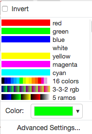

View images in OMERO.iviewer
============================

We introduce 
OMERO.iviewer, a 2D viewer which can
open and browse multi-t, multi-z and multi-channel images and allows to 
draw and edit Regions of Interest.
It also offers the ability to view several images at the same time and synchronize the
view.

Description
-----------

We will show here:

-  How to open multidimensional images in OMERO.iviewer

-  How to change rendering settings in OMERO.iviewer and scroll through z and t

-  How to change the Lookup table and invert the displayed intensities for a particular channel

-  How to use the Histogram feature

-  How to zoom and rotate the image

-  How to save a current viewport as png in OMERO.iviewer

-  How to use and synchronize multiple viewer windows inside OMERO.iviewer

Resources
---------

Example files used

-  https://downloads.openmicroscopy.org/images/DV/siRNAi-HeLa/

Note: Only some of the images in this dataset are z-stacks, for example

-  https://downloads.openmicroscopy.org/images/DV/siRNAi-HeLa/IN_03.r3d_D3D.dv

Setup
-----

**OMERO.iviewer installation**

OMERO.iviewer is a pip installable application for OMERO.web. Follow the
steps described in \ https://pypi.org/project/omero-iviewer/\  to install
it and configure the OMERO.web accordingly.

The walkthrough assumes that OMERO.iviewer has been set up as the
default viewer for OMERO.web.

Step-by-Step
------------

#. Double-click on an Image thumbnail, or click the ``Full Viewer`` |image1|\  button in the right-hand pane to open an Image in a larger viewer called OMERO.iviewer. It is a Web app developed and released independently from the webclient. The OMERO.web framework can be extended with multiple apps to view data in different ways.

#. Zoom in and out of the image by using the ``+`` and ``-`` buttons in top-left corner or by scrolling the mousewheel.

#. Rotate the image by holding ``Shift`` on your keyboard and then drag the image using the mouse.

#. We can adjust the rendering settings and scroll through Z or T.

   .. image:: images/Iviewer2.png

#. To change the Lookup Table (LUT) of a particular channel, click on the downward facing arrow next to the channel label |image1b|.

#. In the menu, select the LUT you wish to use. You can find here all the LUTs which are supported in ImageJ.

   |image1c|

#. In the same menu, you can also invert the intensity of the channel by checking the checkbox on the top.

#. Still staying in the ``Settings`` tab in the right-hand side of OMERO.iviewer, click on the checkbox next to the ``Histogram`` word |image0| near the top.

#. A histogram of the first channel which is on will appear. Note that when you move the rendering settings sliders beneath the histogram, the histogram updates to showing the channel you just manipulated.

   |image0b|

#. Save the viewport by selecting in the top-left corner ``File > Save Viewport as PNG``.

#. Compare the two channels of one of the Images in multi-image view:

    - Double-click on the thumbnail of the already opened Image in the left-hand pane of the viewer. This will open the Image again in a new window.

    - Select one of the windows and in the right-hand pane switch the green channel off.

    - On the other window, switch the blue channel off.

       .. image:: images/Iviewer12.png

#. We can synchronize the viewers by adding them both to the same ``sync Group``.

    - Click the ``sync`` icon \ |image13| in the top-left corner and select the first option in the dropdown menu.

    - Repeat for the other viewer.

    - Now both Images have the ``Z/T`` and ``View`` (zoom and position of viewport) synchronized.

       .. image:: images/Iviewer14.png

#. Click on ``Info`` tab in iviewer now, and find, in the right-hand pane, the link to ``Dataset``: |image15|\ . Click on that link. This will bring you back to the webclient.

.. |image0| image:: images/Iviewer0.png
   :width: 0.79167in
   :height: 0.27083in
.. |image0b| image:: images/Iviewer0b.png
   :width: 2.7in
   :height: 3in
.. |image1| image:: images/Iviewer1.png
   :width: 0.79167in
   :height: 0.27083in

.. |image3| image:: images/Iviewer3.png
   :width: 0.28125in
   :height: 0.33333in
.. |image4| image:: images/Iviewer4.png
   :width: 0.34635in
   :height: 0.32813in
.. |image5| image:: images/Iviewer5.png
   :width: 0.93164in
   :height: 0.32285in
.. |image6| image:: images/Iviewer6.png
   :width: 0.34635in
   :height: 0.32813in
.. |image12| image:: images/Iviewer12.png
   :width: 0.46875in
   :height: 0.28125in
.. |image13| image:: images/Iviewer13.png   
   :width: 0.46875in
   :height: 0.28125in
.. |image14| image:: images/Iviewer14.png
   :width: 0.22917in
   :height: 0.1875in
.. |image15| image:: images/Iviewer15.png
   :width: 2.91667in
   :height: 0.29167in

